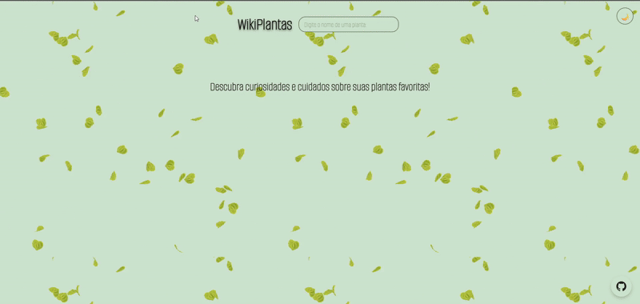

# WikiPlantas

🌿 Base de Conhecimento Botânico

Uma enciclopédia de bolso para amantes de plantas, reunindo informações essenciais de cultivo, curiosidades e referências de forma rápida e acessível.

💡 Sobre o Projeto

A ideia para a WikiPlantas nasceu de uma paixão pessoal por plantas e da necessidade recorrente de pesquisar sobre seus cuidados, características e curiosidades. O objetivo é centralizar informações básicas e essenciais para o dia a dia de quem cultiva, oferecendo uma consulta rápida e visualmente agradável.

Além de fornecer dados como necessidade de água, luz e tipo de solo, cada planta possui um link direto para uma fonte mais aprofundada e confiável (o site Jardineiro.net), permitindo que o usuário explore o assunto com mais detalhes se desejar.

✨ Funcionalidades

- Busca Dinâmica: Filtre as plantas em tempo real pelo nome.
- Informações Detalhadas: Acesse cuidados principais, nível de dificuldade, curiosidades e mais.
- Tags de Categoria: Encontre plantas por características como "Interior", "Purificadora de Ar", "Sol Pleno", etc.
- Design Responsivo: Consulte sua base de conhecimento em qualquer dispositivo, seja no computador, tablet ou celular. Para otimizar a performance e a leitura em telas menores, as imagens das plantas não são exibidas na visualização mobile.
- Tema Claro e Escuro (Dark Mode): Alterne o visual da página para uma leitura mais confortável em diferentes ambientes.
- Links de Aprofundamento: Continue sua pesquisa em um site especializado com apenas um clique.
  
🚀 Tecnologias Utilizadas

Este é um projeto focado em front-end, construído com tecnologias web fundamentais e modernas:

- HTML5: Estrutura semântica do conteúdo.
- CSS3: Estilização completa, incluindo:
- Flexbox para a criação de layouts flexíveis.
- Variáveis CSS para uma fácil customização e implementação do tema claro/escuro.
- Media Queries para garantir a responsividade em diferentes tamanhos de tela.
- Animações e Transições para uma experiência de usuário mais fluida e interativa.
- JavaScript (Vanilla): Manipulação do DOM para renderizar os cards, implementar a funcionalidade de busca, e alternar o tema da aplicação.
- JSON (JavaScript Object Notation): Utilizado como uma base de dados leve e de fácil leitura para armazenar todas as informações das plantas.
- Hospedagem via GitHub Pages: https://giovznna.github.io/WikiPlantas/

🏃‍♀️ Como Utilizar

Como este é um projeto front-end puro, você não precisa de um servidor ou de processos de compilação complexos para executá-lo.

Clone o repositório (ou baixe os arquivos):

```
bash
git clone https://github.com/seu-usuario/seu-repositorio.git 
```
Navegue até a pasta do projeto:
```
bash
cd seu-repositorio
```

Abra o arquivo index.html diretamente no seu navegador de preferência (como Google Chrome, Firefox, etc.).
E pronto! A aplicação estará funcionando localmente.

---------------------------


🎥 Demonstração

Via Web:

<p align="center">
  
</p>

Via Mobile:

<p align="center">
  
</p>

📈 Melhorias futuras: Melhoria no dark mode mobile e filtros de pesquisa.
